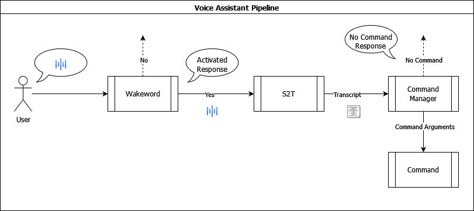

# Sprach Assistent
## Architektur
|  |
|:--:|
| <b>[Fig.1] Pipeline und Funktionsweise der Architektur des Sprachassistenten.</b> (Eigene Darstellung) |

Die Funktionsweise der Pipeline ist wie folgt: Der Sprachassistent hört im hintergund auf seine Umgebung.
Nimmt dieser das Aufwachwort ("Raspi") war, so wird das <i>Speech to Text Modell</i> (S2T) aktiviert.
Dieses erstellt ein Transkript, welches an den <i>CommandManager</i> (CM) weitergegeben wird. Der <i>CM</i> wertet das Transkript aus und überprüft seine interne Liste an Kommandos,
ob ein Kommando gesprochen wurde. Wurde ein Kommando erkannt, so führt dieser dann den Befehl aus.
